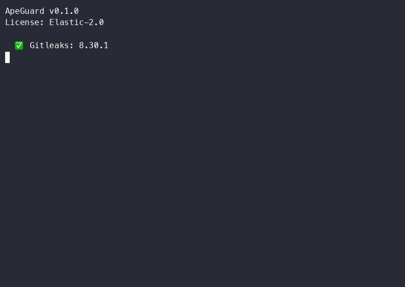

# ApeGuard

**One-command security posture assessment** — layered scanning, [Unified Zero Trust Framework](https://github.com/pirateape/unified-zero-trust-framework) mapping, multi-audience reports.

[](https://github.com/pirateape/ape-guard/actions/workflows/ci.yml)
[](https://github.com/pirateape/ape-guard/releases)
[](LICENSE)

```bash
# Single command — full assessment
apeguard scan

# Three reports, one scan:
#   📋 technical.md  →  for engineers
#   📊 executive.md  →  for leadership
#   🗺️  roadmap.md   →  for engineering managers
```

---

## Features

- **7-layer scanning pipeline** — Secrets → SAST → SCA → Container → DAST → IaC → SBOM in a single command
- **Unified Zero Trust Framework mapping** — Every finding maps to the 8-pillar [UZTF](https://github.com/pirateape/unified-zero-trust-framework) with maturity scoring (Baseline → Advanced → Adaptive). Builds on the CISA Zero Trust Maturity Model as a foundational stepping stone.
- **Multi-audience reports** — Technical (engineers), Executive (leadership), Roadmap (EMs)
- **Multi-format output** — Markdown, JSON, SARIF, HTML
- **Attack chain analysis** — Cross-references findings across scanners to detect multi-stage exploitation paths
- **Architecture risk diagram** — Auto-generated Mermaid diagram of component risks
- **Caching** — SQLite-backed scan cache with TTL-based pruning avoids re-scanning unchanged targets
- **LLM remediation** — Ollama-powered remediation suggestions (local, no data exfiltration)
- **MCP server** — Model Context Protocol (MCP) server for AI agent integration
- **100% local** — No SaaS, no telemetry, no data leaves your machine
- **Zero-cost toolchain** — Gitleaks (MIT) + Semgrep CE (LGPL-2.1) + Trivy (Apache 2.0) + Nuclei (MIT)

---

## Installation

### Prerequisites

Install at least one scanner tool. ApeGuard auto-detects them at runtime:

```bash
# Secrets scanning (Layer 1)
brew install gitleaks
# or: https://github.com/gitleaks/gitleaks/releases

# SAST / static analysis (Layer 2)
pip install semgrep
# or: brew install semgrep

# SCA / vulnerability scanning (Layer 3 + 4)
brew install trivy
# or: https://github.com/aquasecurity/trivy/releases

# DAST / dynamic scanning (Layer 5 — optional)
brew install nuclei
# or: https://github.com/projectdiscovery/nuclei/releases

# IaC misconfiguration scanning (Layer 6 — optional)
pip install checkov
# or: brew install checkov

# SBOM inventory (Layer 7 — optional)
brew install syft
# or: https://github.com/anchore/syft/releases
```

### From source (Rust)

```bash
cargo install apeguard
```

### From GitHub Releases

Download the pre-built binary for your platform from the [releases page](https://github.com/pirateape/ape-guard/releases).

```bash
# Example: Linux x86_64
curl -LO https://github.com/pirateape/ape-guard/releases/latest/download/apeguard-x86_64-unknown-linux-gnu
chmod +x apeguard-x86_64-unknown-linux-gnu
sudo mv apeguard-x86_64-unknown-linux-gnu /usr/local/bin/apeguard
```

### Docker

```bash
docker pull ghcr.io/pirateape/ape-guard:latest
docker run --rm -v "$PWD:/target" ghcr.io/pirateape/ape-guard scan /target
```

---

## Quick Start

```bash
# Initialize config
apeguard init

# Run a full security scan (all available layers)
apeguard scan

# Run specific layers only
apeguard scan --layers 1,2,3

# Scan a container image
apeguard scan --container nginx:latest

# Scan a web target (enables DAST with Nuclei)
apeguard scan --web https://example.com

# Generate HTML report instead of markdown
apeguard scan --format md,html

# Fail CI if high-severity findings found
apeguard scan --fail-on high

# View cached results
apeguard cache stats

# Regenerate reports from cache
apeguard report
```

<p align="center">
  
  <br>
  <sub>Demo GIF generated with <a href="https://github.com/charmbracelet/vhs">VHS</a>. Regenerate via <code>vhs demo.tape</code>.</sub>
</p>

---

## Commands

| Command | Description |
|---------|-------------|
| `scan` | Run a full security assessment on a target directory, container, or web endpoint |
| `report` | Regenerate reports from a cached scan |
| `compare` | Diff findings between two scan snapshots |
| `init` | Create a `.apeguard.yaml` configuration file |
| `config` | Show or validate the current configuration |
| `version` | Display version and scanner availability status |
| `completions` | Generate shell completion scripts |
| `serve` | Start the MCP server for AI agent integration |
| `cache` | Manage the scan cache (stats, prune) |

### Scan options

| Option | Description |
|--------|-------------|
| `--layers` | Scanner layers to run: `1` (secrets), `2` (SAST), `3` (SCA), `4` (container), `5` (DAST), `6` (IaC), `7` (SBOM) |
| `--web` | Web target URL — enables DAST scanning via Nuclei |
| `--container` | Container image(s) to scan (repeatable) |
| `--severity` | Minimum finding severity threshold |
| `--format` | Output format(s): `md`, `json`, `sarif`, `html`, `pdf` (placeholder) |
| `--reports` | Report type(s): `tech`, `exec`, `roadmap` |
| `--fail-on` | Exit code behavior: `never`, `high`, `critical` |
| `--output-dir` | Report output directory (default: `.apeguard/reports`) |
| `--no-cache` | Force a full re-scan, ignoring cache |

---

## Architecture

### Layer Model

```
Layer 1 ─ Secrets ───── Gitleaks ──── regex & entropy detection
Layer 2 ─ SAST ──────── Semgrep ───── static analysis (40+ languages)
Layer 3 ─ SCA vulns ─── Trivy fs ──── filesystem dependency scanning
Layer 4 ─ Container ─── Trivy image ─ container image vulnerability scanning
Layer 5 ─ DAST ──────── Nuclei ────── dynamic web/template scanning
Layer 6 ─ IaC ───────── Checkov ───── infrastructure-as-code misconfiguration scanning
Layer 7 ─ SBOM ──────── Syft ──────── software bill of materials inventory
```

### Pipeline

```
Target
  │
  ├─ gitleaks ──┐
  ├─ semgrep ───┤
  ├─ trivy fs ──┤
  ├─ trivy image┤
  ├─ nuclei ────┤
  ├─ checkov ───┤
  ├─ syft ──────┘
  │
  ▼
Deduplication ─── (file, line, rule_id) composite key
  │
  ├─ Cross-reference ──── Attack chain builder
  ├─ ZT mapping ───────── 8-pillar maturity scorecard
  ├─ Severity filter
  ├─ LLM remediation ──── Ollama local model (optional)
  │
  ▼
Reports ─── technical.md  executive.md  roadmap.md  + JSON / SARIF / HTML
```

### Finding ID format

Every finding receives a unique identifier: `AG-{SCANNER}-{DATE}-{NONCE8}-{SEQ}`

Example: `AG-GL-20260531-a1b2c3d4-001`

---

## Zero Trust Framework Mapping

ApeGuard implements the [Unified Zero Trust Framework (UZTF)](https://github.com/pirateape/unified-zero-trust-framework) — an 8-pillar maturity model that builds on the [CISA Zero Trust Maturity Model](https://www.cisa.gov/zero-trust-maturity-model) as its foundational stepping stone.

> **UZTF** adds quantitative scoring and automated gap analysis on top of CISA's strategic maturity tiers. CISA defines *what* Zero Trust looks like; UZTF defines *how to measure and achieve it*.

Each finding is mapped to one or more UZTF pillars:

| Pillar | Description | Example Finding | CISA Origin |
|--------|-------------|-----------------|-------------|
| **Identity** | Authentication & authorization | Hardcoded API keys | Direct: CISA Identity |
| **Device** | Endpoint health & compliance | Outdated dependency | Direct: CISA Devices |
| **Network** | Segmentation & traffic security | Open port / SSRF | Direct: CISA Networks |
| **Application** | App security & input validation | SQL injection / XSS | Direct: CISA Applications |
| **Data** | Encryption & classification | Secrets in source | Direct: CISA Data |
| **Visibility** | Monitoring & analytics | Missing audit log | Extension of CISA cross-cutting |
| **Automation** | Automated response & orchestration | CI/CD misconfig | Extension of CISA cross-cutting |
| **Infrastructure** | Cloud/host configuration | IAM misconfig | Extension of CISA cross-cutting |

### Maturity Scoring (UZTF)

- **Baseline** (0–50): Foundational controls present, significant gaps
- **Advanced** (51–80): Proactive security measures implemented
- **Adaptive** (81–100): Real-time, automated, self-healing posture

The scorecard shows pillar-by-pillar maturity with actionable gap analysis. For the full framework specification, see the [UZTF repository](https://github.com/pirateape/unified-zero-trust-framework).

---

## Reports

ApeGuard generates three report types from every scan, stored in `.apeguard/reports/`:

### Technical Report (`technical.md`)
For **engineers**. Lists every finding with file location, severity, CWE/CVSS references, ZT pillars, MITRE ATT&CK tactics, attack chain cross-references, and remediation steps.

### Executive Report (`executive.md`)
For **leadership**. Risk posture summary, severity breakdown, Zero Trust scorecard, top risks, and trend indicators.

### Roadmap Report (`roadmap.md`)
For **engineering managers**. Prioritized remediation plan organized by time horizon (Immediate / Short-term / Long-term), organized by ZT pillar and severity.

### Additional Formats

- **JSON** — Machine-readable output for CI/CD pipelines and tool integration
- **SARIF 2.1** — Standardized format for GitHub Security tab and SARIF-compatible tooling
- **HTML** — Self-contained dark-themed report with severity badges, ZT scorecard cards, and architecture diagram

---

## Configuration

ApeGuard reads from `.apeguard.yaml` in the target directory (generated via `apeguard init`):

```yaml
layers:
  - 1
  - 2
  - 3
severity: all
binaries:
  gitleaks: null       # custom path, null = auto-detect in PATH
  semgrep: null
  trivy: null
cache:
  enabled: true
  path: .apeguard/cache
  ttl_hours: 24
report:
  formats:
    - md
  types:
    - tech
    - exec
    - roadmap
output_dir: .apeguard/reports
```

---

## MCP Server (AI Agent Integration)

ApeGuard implements the [Model Context Protocol (MCP)](https://modelcontextprotocol.io/) for integration with AI-powered development tools.

```bash
# Start the MCP server
apeguard serve
```

### MCP Tools

| Tool | Description |
|------|-------------|
| `scan` | Run security assessment (layers 1–5) with optional severity filter |
| `list_tools` | Enumerate available MCP tools |
| `resources/read` | Access scan reports, scorecards, and architecture analysis |

### MCP Resources

| URI | Description |
|-----|-------------|
| `apeguard://reports/{scan_id}` | Full scan report |
| `apeguard://scorecard/{scan_id}` | Zero Trust scorecard |
| `apeguard://latest` | Latest scan summary |
| `apeguard://arch_analysis` | Architecture component risk assessment with Mermaid diagram |

---

## Development

```bash
# Clone and build
git clone https://github.com/pirateape/ape-guard
cd apeguard
cargo build

# Run tests
cargo test

# Run specific module tests
cargo test report::tests

# Check with clippy
cargo clippy

# Format code
cargo fmt
```

### Project structure

```
src/
├── main.rs            # Entry point, CLI dispatch
├── cli.rs             # CLI argument parsing (clap)
├── config.rs          # YAML configuration loader
├── mcp.rs             # MCP server implementation
├── scanner/
│   ├── mod.rs         # Scanner trait + shared timeout helper
│   ├── gitleaks.rs    # Layer 1: Secrets scanning
│   ├── semgrep.rs     # Layer 2: SAST
│   ├── trivy.rs       # Layer 3: Filesystem SCA
│   ├── container.rs   # Layer 4: Container image scanning
│   └── dast.rs        # Layer 5: DAST (Nuclei)
├── find/
│   └── mod.rs         # Canonical finding, severity, scorecard types
├── normalize.rs       # ZT pillar mapping + MITRE ATT&CK
├── chain.rs           # Attack chain builder
├── arch.rs            # Architecture discovery + risk assessment
├── report/
│   └── mod.rs         # Report generator (markdown, JSON, SARIF, HTML)
├── dedup.rs           # Finding deduplication
├── cache.rs           # SQLite-backed scan cache
└── llm.rs             # Ollama remediation
```

---

## CI/CD Integration

```yaml
# .github/workflows/security-scan.yml
name: Security Scan
on: [push, pull_request]
jobs:
  apeguard:
    runs-on: ubuntu-latest
    steps:
      - uses: actions/checkout@v4
        with:
          fetch-depth: 0  # required for Gitleaks PR scanning
      - name: Install scanners
        run: |
          brew install gitleaks semgrep trivy
      - name: Install ApeGuard
        run: cargo install apeguard
      - name: Run security scan
        run: apeguard scan --fail-on high --format sarif
      - name: Upload SARIF to GitHub
        uses: github/codeql-action/upload-sarif@v3
        with:
          sarif_file: .apeguard/reports/*.sarif
```

---

## Licensing

Licensed under the **Elastic License 2.0** (EL-2.0).

You may use, copy, modify, and redistribute this software in any project — including commercial — as long as you do not provide it as a paid SaaS product. See the [LICENSE](LICENSE) file for details.

### Scanner tool licenses

| Tool | License | Layer |
|------|---------|-------|
| Gitleaks | MIT | 1 — Secrets |
| Semgrep CE | LGPL-2.1 | 2 — SAST |
| Trivy | Apache 2.0 | 3 + 4 — SCA / Container |
| Nuclei | MIT | 5 — DAST |
| Checkov | Apache 2.0 | 6 — IaC |
| Syft | Apache 2.0 | 7 — SBOM |

---

## Related

- [Unified Zero Trust Framework (UZTF)](https://github.com/pirateape/unified-zero-trust-framework) — 8-pillar maturity model with quantitative scoring (what this tool implements)
- [ApeGuard GitHub Action](https://github.com/pirateape/apeguard-action) — Run layered scans in CI/CD pipelines
- [Azure Security Audit Framework](https://github.com/pirateape/Azure-Security) — 148+ Azure defense-in-depth resources (KQL, PowerShell, Policies, Workbooks)
- [CISA Zero Trust Maturity Model](https://www.cisa.gov/zero-trust-maturity-model) — Foundational ZT framework from the US Federal government (UZTF builds on this)
- [MITRE ATT&CK](https://attack.mitre.org/) — Adversarial tactics & techniques
- [Model Context Protocol](https://modelcontextprotocol.io/) — AI agent integration standard
